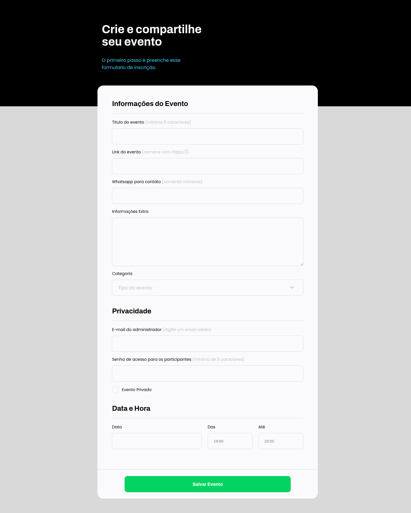
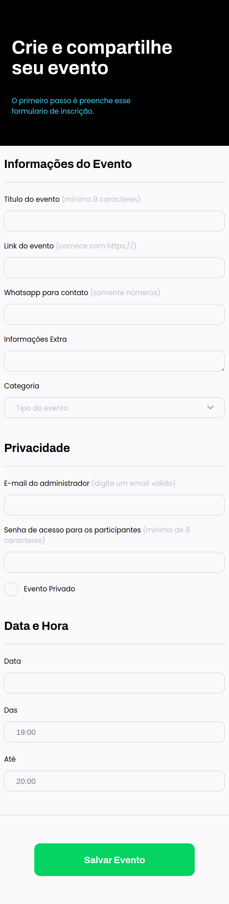

<h1 align="center">Desafio 4 - Rocketseat</h1>

Desenvolver um layout disponibilizado no Figma com HTML e CSS

Link do projeto: <a href="https://arielemartins.github.io/exercicios_explorer_rocketseat/projeto_4/" target="_blank" >Desafio 4</a>

<h1 align="center">DESKTOP</h1>

<h1 align="center">MOBILE</h1>

<h1 align="center">TECNOLOGIAS</h1>

    
    

<h1 align="center">DESENVOLVEDORES</h1>

    
    <h2 >Ariele Martins</h2>

